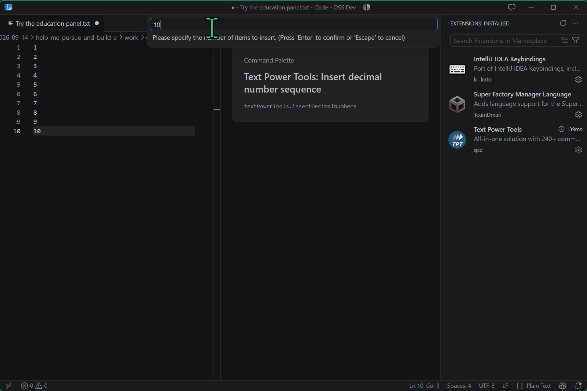
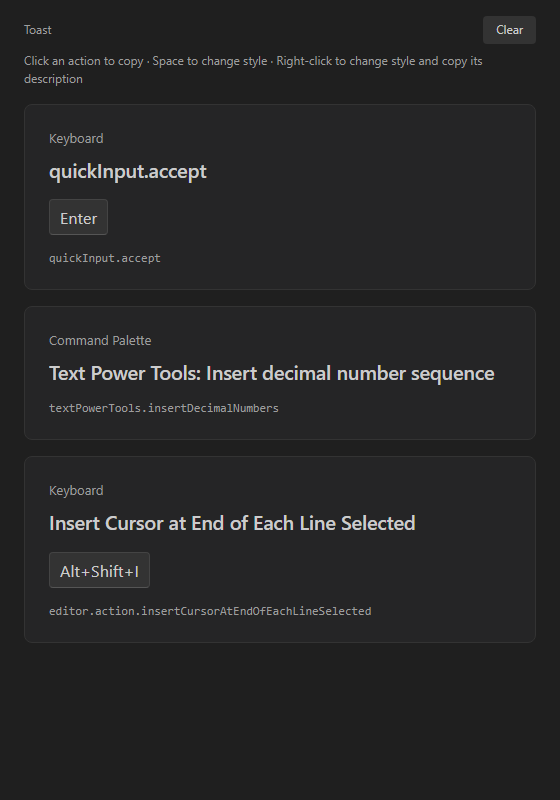

# Code - OSS Education

A VS Code fork for teaching and screen sharing. The education panel shows what you just did: the command's name, its ID, and the keyboard shortcut you used or that you chose it from the Command Palette.

Commands without a keyboard shortcut appear too. Your existing keybindings keep working. The fork observes commands at keyboard dispatch and Command Palette acceptance, so extension actions can appear without custom bindings or wrappers.

Text Power Tools opens a follow-up prompt for **Insert decimal number sequence**. The panel records the original palette action before that prompt is answered.

## Keep the steps visible

The panel keeps an action history with the newest item at the top and earlier actions below. If pressing Enter in an extension's prompt invokes a Quick Pick command, it adds another entry; **Insert decimal number sequence** remains below it. Repeated actions get separate entries so viewers can follow the sequence.

Each card shows the registered command title, command ID and invocation source. Keyboard actions include the actual keys used, including chords. Actions appear when invoked, without waiting for completion; a cancelled or failed command can still appear. If no registered title exists, the panel shows the command ID.

## Use the panel

Run **Keyboard Shortcut Education Panel: Open** from the Command Palette. It opens beside your editor.

| Control | Behavior |
| --- | --- |
| Click a card, or focus it and press Enter | Copy that action as Discord-ready text, including older entries |
| Space while the panel is focused | Cycle through Toast, Keycaps and Terminal styles |
| Right-click the panel | Cycle style and copy the new style's name, ID and description |
| Clear | Empty the action history |

The style name, usage hint and Clear button appear on hover or focus, and hide when neither applies. Clear stays within reach while scrolling through a long history. **Set Style**, **Next Style** and **Clear History** are also available under **Keyboard Shortcut Education Panel** in the Command Palette.

History lives in memory while the panel is open. Clear or closing the panel removes it; reopening starts empty. The panel collects command metadata only: it does not read typed text, command arguments, editor contents or clipboard contents. It writes to the clipboard only when you request a copy. Background programmatic commands are not collected.

## Build this branch

This branch is based on VS Code **1.137.0**. It includes the native command hooks and a bundled education extension that uses the fork's custom API. The current build and launcher target a Windows development checkout with a separate education profile.

**[Build, launch and configure extensions](docs/education-panel.md)**

The guide covers prerequisites, first-time setup, fast rebuilds and Open VSX configuration. Text Power Tools and the other extensions shown in the screenshot are installed separately.
